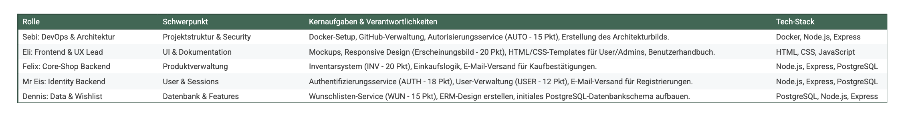
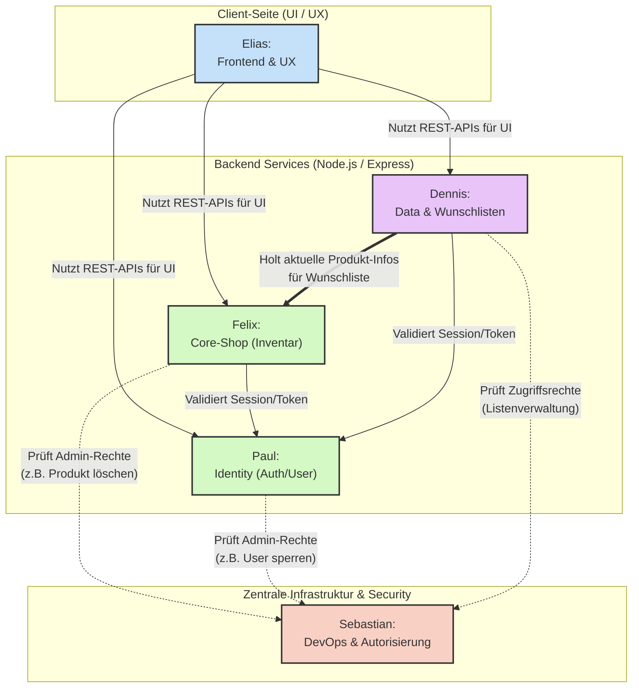

# WebEngineeringDPESM

## Aufgabeneinteilung

## Schnittstellen Diagramm

```mermaid
flowchart TD
    %% Styling Klassen für eine bessere Optik
    classDef devops fill:#f9d0c4,stroke:#333,stroke-width:2px;
    classDef frontend fill:#c4e1f9,stroke:#333,stroke-width:2px;
    classDef backend fill:#d4f9c4,stroke:#333,stroke-width:2px;
    classDef database fill:#e8c4f9,stroke:#333,stroke-width:2px;

    %% Gruppierung: Frontend
    subgraph Client ["Client-Seite (UI / UX)"]
        P2["Elias:\nFrontend & UX"]:::frontend
    end

    %% Gruppierung: Backend Services
    subgraph API ["Backend Services (Node.js / Express)"]
        P3["Felix:\nCore-Shop (Inventar)"]:::backend
        P4["Paul:\nIdentity (Auth/User)"]:::backend
        P5["Dennis:\nData & Wunschlisten"]:::database
    end

    %% Gruppierung: Infrastruktur & Security
    subgraph Core ["Zentrale Infrastruktur & Security"]
        P1["Sebastian:\nDevOps & Autorisierung"]:::devops
    end

    %% Frontend Schnittstellen (API-Konsum)
    P2 -- "Nutzt REST-APIs für UI" --> P3
    P2 -- "Nutzt REST-APIs für UI" --> P4
    P2 -- "Nutzt REST-APIs für UI" --> P5

    %% Backend zu Auth (Wer ist eingeloggt?)
    P3 -- "Validiert Session/Token" --> P4
    P5 -- "Validiert Session/Token" --> P4

    %% Backend zu Autorisierung (Darf der User das?)
    P3 -. "Prüft Admin-Rechte\n(z.B. Produkt löschen)" .-> P1
    P4 -. "Prüft Admin-Rechte\n(z.B. User sperren)" .-> P1
    P5 -. "Prüft Zugriffsrechte\n(Listenverwaltung)" .-> P1

    %% Interne Backend-Logik & Datenbank
    P5 == "Holt aktuelle Produkt-Infos\nfür Wunschliste" ==> P3

    %% Infrastruktur Hinweis (versteckte Links für Layouting)
    P1 ~~~ P3
```

