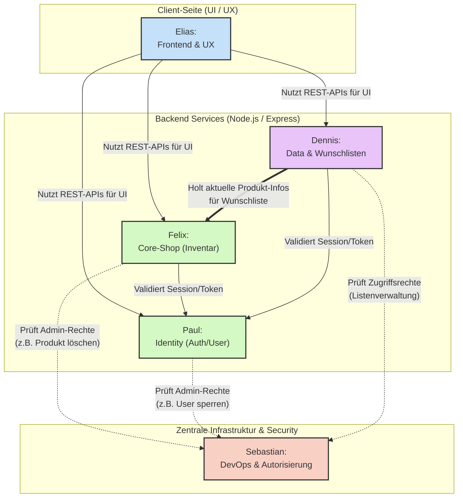

# WebEngineeringDPESM

## Aufgabeneinteilung


## Schnittstellen Diagramm




## Lokales Starten mit Docker

### Voraussetzungen

* Docker Desktop muss installiert und gestartet sein.
* Das Repository muss lokal geklont sein.
* Alle Befehle werden im Projekt-Hauptordner ausgeführt.

### Projekt aktualisieren

```bash
git pull
```

### Container starten

```bash
docker compose up --build
```

Beim ersten Start werden die benötigten Images geladen und das Backend-Image gebaut. Danach laufen folgende Dienste:

| Dienst      | URL / Port                       | Zweck                                                   |
| ----------- | -------------------------------- | ------------------------------------------------------- |
| Webshop-App | http://localhost:3000            | Frontend und Express-Backend                            |
| Healthcheck | http://localhost:3000/api/health | Prüft Backend und Datenbankverbindung                   |
| Maildev     | http://localhost:1080            | Lokale Testoberfläche für E-Mails                       |
| pgAdmin     | http://localhost:5050            | Datenbankadministration für Entwicklung                 |
| PostgreSQL  | localhost:5433                   | Externer Zugriff auf die Datenbank, z. B. über DB-Tools |

### Erwarteter Healthcheck

Im Browser öffnen:

```text
http://localhost:3000/api/health
```

Erwartete Antwort:

```json
{
  "status": "ok",
  "service": "backend",
  "database": "connected",
  "time": "..."
}
```

### AUTO-1 Autorisierung prüfen

Der zentrale Autorisierungs-Endpunkt entscheidet, ob ein User eine Aktion auf einer Ressource ausführen darf:

```text
POST http://localhost:3000/api/auto/check
```

Beispiel-Request:

```json
{
  "userId": 1,
  "resourceType": "product",
  "resourceId": 7,
  "action": "delete"
}
```

Beispiel-Antwort:

```json
{
  "allowed": false,
  "reason": "admin_required",
  "user": {
    "id": 1,
    "isAdmin": false,
    "isVerified": true,
    "isBlocked": false
  },
  "resource": {
    "type": "product",
    "id": 7
  },
  "action": "delete"
}
```

Unterstützte Ressourcentypen:

```text
product, wishlist, user, order
```

Unterstützte Aktionen sind auf Englisch und Deutsch möglich, z. B.:

```text
read/lesen, create/erstellen, update/bearbeiten, delete/löschen, buy/kaufen, share/teilen
```

Wichtig: Bis der Auth-Service fertig ist, akzeptiert der Prüf-Endpunkt `userId` im Request-Body. Sobald `authenticate` vorhanden ist, wird `req.user.id` bevorzugt und `userId` aus dem Body nur noch für Tests relevant sein.

### pgAdmin-Zugang

pgAdmin öffnen:

```text
http://localhost:5050
```

Login:

```text
E-Mail:    admin@webshop.dev
Passwort:  admin
```

Danach in pgAdmin einen neuen Server registrieren:

Tab **General**:

```text
Name: webshop-db
```

Tab **Connection**:

```text
Host name/address: db
Port: 5432
Maintenance database: webshop
Username: webshop_user
Password: webshop_password
```

Wichtig: In pgAdmin muss als Host `db` verwendet werden, nicht `localhost`, weil pgAdmin selbst in einem Docker-Container läuft.

### Maildev

Maildev öffnen:

```text
http://localhost:1080
```

Dort erscheinen später lokale Testmails, z. B. Registrierungslinks, Login-Codes oder Einkaufsbestätigungen.

### Webshop-Testlogin

Für die geschützten Admin- und Verwaltungsbereiche wird beim Zurücksetzen der Datenbank ein verifizierter Admin-User angelegt:

```text
E-Mail:    admin@webshop.dev
Passwort:  admin1234
```

### Container stoppen

```bash
docker compose down
```

Dieser Befehl stoppt und entfernt die Container, behält aber die Datenbank-Volumes. Die lokalen Daten bleiben also erhalten.

### Datenbank komplett zurücksetzen

Nur verwenden, wenn die lokale Entwicklungsdatenbank vollständig gelöscht und neu aus `database/init.sql` aufgebaut werden soll:

```bash
docker compose down -v
docker compose up --build
```


# Gentleman Shop Frontend

> Die vollständige Planung der UI mit Seitenstruktur, Farbschema, Responsive-Konzept und Verlinkungsdiagrammen befindet sich in [`docs/UI-Planung.md`](docs/UI-Planung.md).

Statisches HTML/CSS-Frontend für das Web-Engineering-Projekt.

Enthalten:
- Startseite mit Slideshow, Produkten, Kollektionen
- Produktübersicht
- Kollektion
- Produktdetailseite
- Warenkorb
- Checkout
- Kaufhistorie
- Login, Registrierung, Verifizierung, Magic Login
- Wunschlistenübersicht und Detailseite
- Admin-Dashboard, Produktverwaltung, Userverwaltung
- Rechtliche Seiten im Footer

Start:
1. ZIP entpacken
2. Ordner in VS Code öffnen
3. index.html mit Live Server öffnen

- Eigene Kategorieseiten: Anzüge, Hemden, Schuhe, Zubehör, Pflege
- Header-Suche als eigene Suchseite

## Schnittstellen für Teammitglieder

Das Projekt bleibt bewusst nur HTML/CSS. Die Formulare, Tabellen und Buttons sind als UI-Schnittstellen vorbereitet:

- Inventarsystem: `pages/shop/products.html`, `pages/shop/product-detail.html`, `pages/shop/cart.html`, `pages/shop/checkout.html`, `pages/shop/orders.html`
- Admin-Produkte: `pages/admin/products.html` mit Suche per Produkt-ID, Erstellen, Bearbeiten und Löschen
- Wunschlisten: `pages/wishlist/wishlists.html` und `pages/wishlist/wishlist-detail.html` mit Erstellen, Bearbeiten, Löschen, Teilen und Berechtigungen
- Authentifizierung: `pages/auth/login.html`, `register.html`, `verify.html`, `magic-login.html`
- Autorisierung: Prüffläche im `pages/admin/dashboard.html`
- User-Verwaltung: `pages/admin/users.html` mit User-ID-Suche, Sperren, Entsperren, Löschen und Admin-Erstellung
