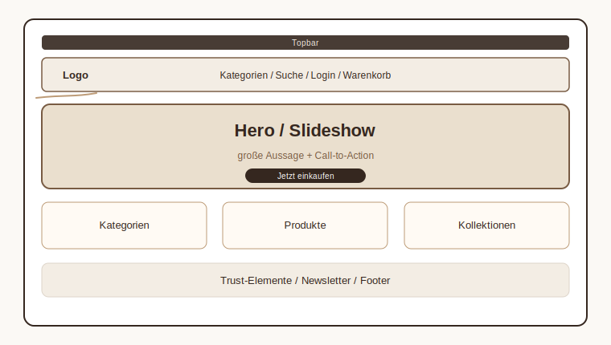
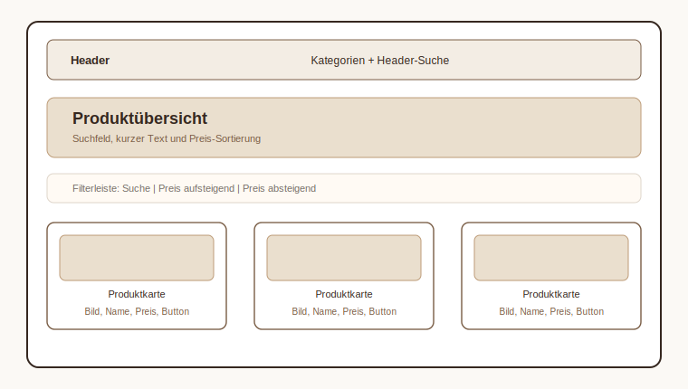
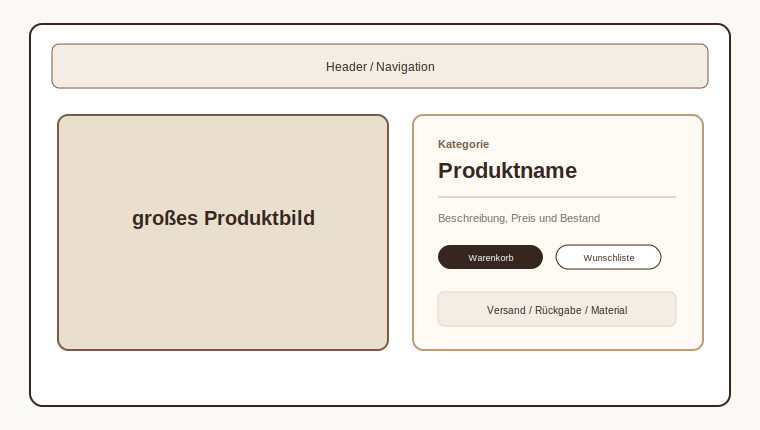
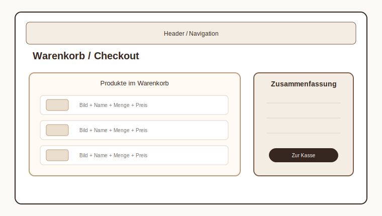
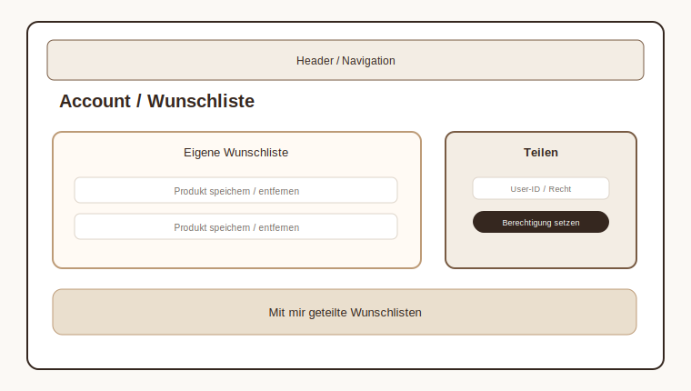
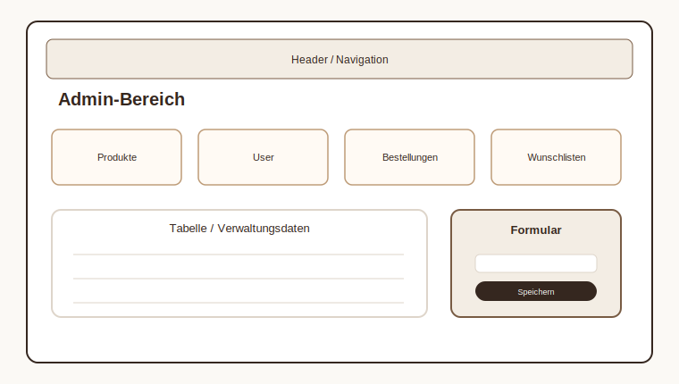
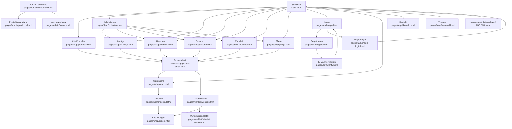

# Mockup

## Ziel der Oberfläche (UI)

Der Gentleman-Shop soll sauber, ruhig und hochwertig wirken. Die Seite soll nicht wie eine Demo aussehen, sondern wie ein kleiner echter Onlineshop für Herrenmode.

Wichtige Designziele:

- klare Navigation
- große Produktflächen
- warme Farben
- viel Weißraum
- gut erkennbare Buttons
- einfache Bedienung auf Desktop und Handy

## Grundaufbau der Webseiten

Die meisten Seiten folgen demselben Grundaufbau.

- Topbar
- Header
- Hauptbereich
- Footer

### Startseite

Die Startseite soll direkt zeigen, worum es geht: hochwertiger Gentleman-Shop.

- Hero / Slideshow als erster Blickfang
- klare Call-to-Action Buttons
- Kategorien für schnelle Orientierung
- Produkt-Highlights
- Trust-Elemente wie Versand und Qualität
- Newsletter-Bereich

### Shop- und Kategorie-Seiten

Diese Seiten sind für das Stöbern und Suchen gedacht.

- Überschrift mit kurzer Beschreibung
- Suchfeld
- Preis-Sortierung
- Produktkarten mit Bild, Name, Preis und Button
- Desktop: mehrere Spalten
- Mobile: eine Spalte

### Produktdetailseite

Die Detailseite soll genug Informationen geben, damit man kaufen kann.

- großes Produktbild
- Produktname
- Beschreibung
- Preis
- Lagerbestand
- Warenkorb-Button
- Wunschlisten-Button
- Versandhinweise

### Warenkorb und Checkout

Der Kaufprozess soll möglichst klar sein.

- Warenkorb links mit Produkten
- Zusammenfassung rechts
- Checkout mit Bestellübersicht
- klare Fehlermeldungen, falls etwas fehlt
- nach Bestellung Weiterleitung zur Historie

### Account und Wunschlisten

Dieser Bereich ist für eingeloggte User.

- eigene Wunschliste
- Produkte entfernen
- Wunschliste teilen
- geteilte Wunschlisten anzeigen
- Bestellhistorie erreichen

### Admin-Bereich

Der Admin-Bereich ist sachlicher als der normale Shop.

- Dashboard als Einstieg
- Produktverwaltung
- Userverwaltung
- Tabellen für schnelle Übersicht
- Formulare für neue oder bearbeitete Daten

## Verlinkung zwischen den Webseiten

## Farbschema

Das Farbschema orientiert sich an Gentleman-Mode: warm, ruhig und hochwertig. Braun wirkt bodenständig und vertraut, Gold-/Camel-Töne wirken etwas edler. Cremeweiß und Weiß sorgen für genug Ruhe und Lesbarkeit. Anthrazit wird für Text und Kontrast verwendet.

| Farbe | Beispiel | Verwendung |
| --- | --- | --- |
| `#22201e` |  | Haupttext / Anthrazit |
| `#35271f` |  | Dunkelbraun / starke Akzente |
| `#785b43` |  | Braun / Buttons |
| `#bd9b77` |  | Camel / goldener Akzent |
| `#f3ede4` |  | Creme / Hintergrund |
| `#fbf9f5` |  | Papierweiß / Flächen |

## Responsive Planung

Desktop:

- breite Navigation
- Produktkarten in mehreren Spalten
- Warenkorb links und Zusammenfassung rechts
- Admin-Tabellen übersichtlich nebeneinander

Mobile:

- Inhalte werden einspaltig
- Karten laufen untereinander
- Tabellen können horizontal scrollen
- Header bleibt schmal und bricht nicht aus
- Footer wird untereinander gestapelt
