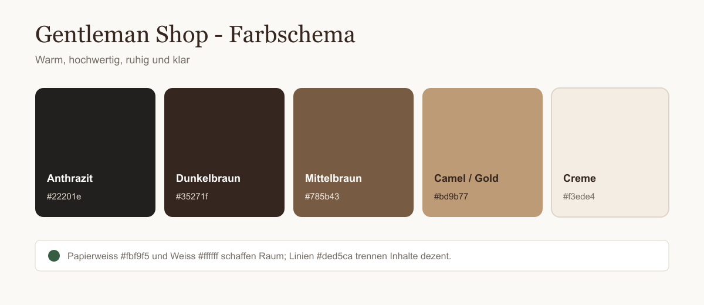
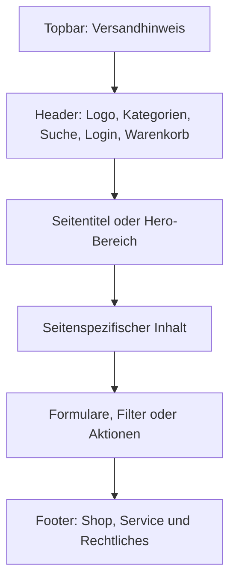
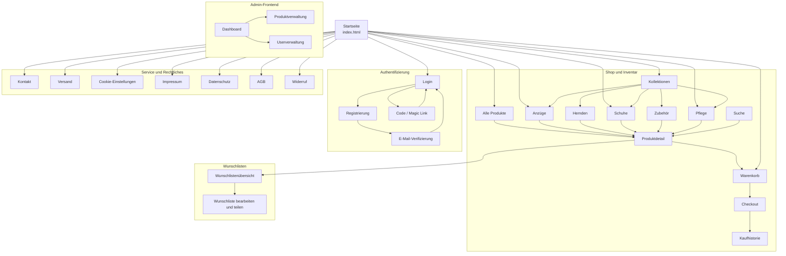
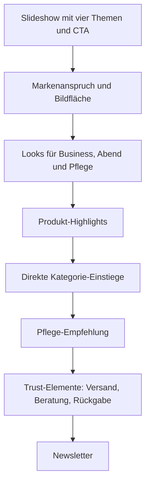
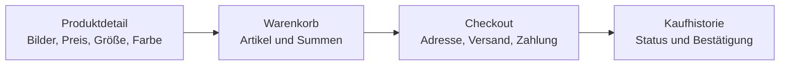
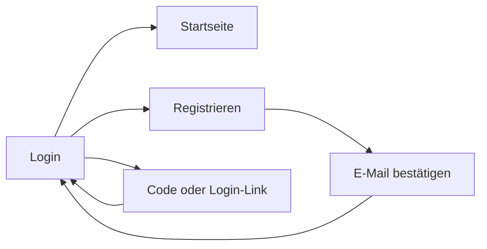
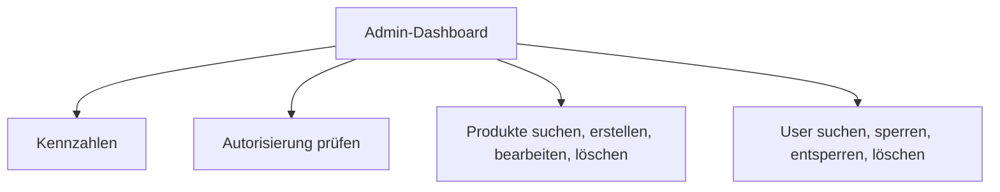

# UI-Planung - Gentleman Shop

## 1. Ziel der Benutzeroberfläche

Der Gentleman Shop soll wie ein hochwertiger, ruhiger und moderner Onlineshop für Herrenmode wirken. Die Gestaltung ist bewusst übersichtlich und reduziert. Kunden sollen Kategorien, Produkte und wichtige Aktionen schnell erkennen, ohne von zu vielen Elementen abgelenkt zu werden.

Die UI orientiert sich an folgenden Grundsätzen:

- hochwertige und warme Wirkung statt eines technischen Standardlayouts
- klare Navigation mit kurzen Wegen zu allen Produktkategorien
- viel Weißraum für eine ruhige und professionelle Darstellung
- einheitliche Produktkarten, Formulare, Tabellen und Aktionsbuttons
- getrennte Oberflächen für normale Benutzer und Administratoren
- responsive Darstellung für Widescreen, Hochformat und Smartphone
- reine HTML/CSS-Struktur als einfache Grundlage für die spätere Backend-Anbindung

## 2. Visuelles Konzept

Das Grunddesign verwendet Cremeweiß und Papierweiß als ruhige Flächen. Dunkelbraun und Anthrazit sorgen für Kontrast, Lesbarkeit und eine maskuline Wirkung. Mittelbraun sowie Camel-/Goldtöne werden als hochwertige Akzente eingesetzt.

Braun vermittelt im geplanten Design Wärme, Beständigkeit, Handwerk und Natürlichkeit. Camel- und Goldtöne unterstützen den Premium-Charakter des Shops. Die hellen Flächen verhindern, dass die Oberfläche zu schwer oder dunkel wirkt.

### Verwendete Farben

| CSS-Variable | HEX | RGB | Verwendung und Wirkung |
|---|---:|---:|---|
| `--ink` | `#22201e` | `rgb(34, 32, 30)` | Haupttext, sehr dunkles Anthrazit |
| `--ink-soft` | `#4b4641` | `rgb(75, 70, 65)` | Navigation und weichere Texte |
| `--brown-dark` | `#35271f` | `rgb(53, 39, 31)` | Header-Akzente, Footer und primäre Buttons |
| `--brown` | `#785b43` | `rgb(120, 91, 67)` | Hover-Zustände, Eyebrows und Akzente |
| `--camel` | `#bd9b77` | `rgb(189, 155, 119)` | Heller Braun-/Goldton für Premium-Akzente |
| `--cream` | `#f3ede4` | `rgb(243, 237, 228)` | Hero- und Informationsflächen |
| `--paper` | `#fbf9f5` | `rgb(251, 249, 245)` | Haupthintergrund der Anwendung |
| `--white` | `#ffffff` | `rgb(255, 255, 255)` | Karten, Formulare und Inhaltsflächen |
| `--line` | `#ded5ca` | `rgb(222, 213, 202)` | dezente Rahmen und Trennlinien |
| `--muted` | `#746d66` | `rgb(116, 109, 102)` | sekundäre Texte und Beschreibungen |
| `--success` | `#365d42` | `rgb(54, 93, 66)` | erfolgreiche oder aktive Statusanzeigen |

## 3. Globale Seitenstruktur

Alle öffentlichen Seiten verwenden denselben grundlegenden Aufbau. Dadurch bleibt die Bedienung vorhersehbar und die späteren Backend-Komponenten können wiederverwendet werden.

### Wiederkehrende Komponenten

| Komponente | Aufgabe |
|---|---|
| Topbar | kostenloser Versand und kurze Markenbotschaft |
| Header | globale Navigation und CSS-only-Suchfeld |
| Page Hero | Seitenname, Kategorie und kurze Orientierung |
| Produktkarte | Produktbild, Name, Beschreibung, Status und Preis |
| Filterleiste | Kategorieauswahl, Preissortierung und Suche |
| Formular | Login, Registrierung, Checkout oder Verwaltungsaktionen |
| Status-Badge | Lager-, Konto-, Bestell- oder Berechtigungsstatus |
| Footer | zentrale Links zu Shop, Service und rechtlichen Seiten |

## 4. Sitemap und Verlinkung

Die folgende Sitemap zeigt die geplante Informationsarchitektur und die wichtigsten Verbindungen zwischen den Seiten.

### Legende

- **Pfeil:** direkte Navigation oder typischer nächster Schritt
- **Shop und Inventar:** öffentlich sichtbare Produkt- und Kaufseiten
- **Authentifizierung:** Registrierung, Anmeldung und Kontobestätigung
- **Wunschlisten:** persönliche Listen und Freigaben für andere Benutzer
- **Admin-Frontend:** nur für Administratoren vorgesehene Verwaltungsseiten
- **Service und Rechtliches:** über den Footer erreichbare Informationsseiten

## 5. Aufbau der wichtigsten Seitentypen

### 5.1 Startseite

Die Startseite dient als zentraler Einstieg. Sie verbindet emotionale Markenwirkung mit kurzen Wegen zu Produkten, Kategorien und wichtigen Kaufargumenten.

### 5.2 Kategorien und Produktübersicht

- Seitentitel und kurze Kategoriebeschreibung
- Suche innerhalb der Kategorie
- Preisfilter: aufsteigend und absteigend
- responsive Produktkarten
- Klick auf eine Produktkarte führt zur Produktdetailseite
- `collection.html` dient als Zwischenseite für alle fünf Hauptkategorien

### 5.3 Produktdetail und Kaufprozess

Die Produktdetailseite stellt alle kaufrelevanten Informationen zusammen. Nicht verfügbare Produkte werden sichtbar gekennzeichnet und sollen später durch das Inventarsystem vom Kauf ausgeschlossen werden.

### 5.4 Authentifizierung

Die Auth-Seiten verwenden ein gemeinsames, kompaktes Formularlayout. Dadurch wirken Registrierung, Verifizierung und alternative Anmeldung wie ein zusammenhängender Prozess.

### 5.5 Wunschlisten

- Übersicht eigener und geteilter Wunschlisten
- Liste erstellen oder löschen
- Name und Beschreibung bearbeiten
- Produkte hinzufügen und entfernen
- Berechtigungen: Lesen, Schreiben oder Besitzer
- genau ein Besitzer pro Wunschliste

### 5.6 Admin-Bereich

Der Admin-Bereich ist sachlicher aufgebaut als der öffentliche Shop. Tabellen, Statusanzeigen und kompakte Formulare stehen hier im Vordergrund.

## 6. Navigationsmatrix

| Ausgangsseite | Link oder Aktion | Zielseite |
|---|---|---|
| alle Seiten | Logo | `index.html` |
| alle Seiten | Anzüge, Hemden, Schuhe, Zubehör, Pflege | jeweilige Kategorieseite |
| alle Seiten | Suche | `pages/shop/search.html` |
| alle Seiten | Login | `pages/auth/login.html` |
| alle Seiten | Warenkorb | `pages/shop/cart.html` |
| Startseite | Alle Produkte | `pages/shop/products.html` |
| Startseite | Kategorie-Karten | jeweilige Kategorieseite |
| Footer | Kollektionen | `pages/shop/collection.html` |
| Kollektionen | eine der fünf Karten | jeweilige Kategorieseite |
| Produktkarte | Produkt auswählen | `pages/shop/product-detail.html` |
| Produktdetail | In den Warenkorb | `pages/shop/cart.html` |
| Produktdetail | Zur Wunschliste | `pages/wishlist/wishlists.html` |
| Warenkorb | Zur Kasse | `pages/shop/checkout.html` |
| Checkout | Kaufen | `pages/shop/orders.html` |
| Login | Registrieren | `pages/auth/register.html` |
| Login | Login per Code oder Link | `pages/auth/magic-login.html` |
| Admin-Dashboard | Produkte verwalten | `pages/admin/products.html` |
| Admin-Dashboard | User verwalten | `pages/admin/users.html` |

## 7. Responsive Planung

| Ansicht | Breite | Geplanter Aufbau |
|---|---:|---|
| Widescreen | ab `1440px` | breite Inhaltsfläche, vier Produktspalten, fünf Kollektionen nebeneinander |
| Desktop | `981px` bis `1439px` | drei Produktspalten, vollständige Navigation |
| Hochformat / Tablet | `701px` bis `1100px` im Hochformat | zwei Spalten, Formulare und Detailbereiche untereinander |
| Smartphone | bis `700px` | eine Spalte, kompakter Header, gestapelter Footer, scrollbar lesbare Tabellen |

Wichtige responsive Regeln:

- keine horizontale Seiten-Scrollbar
- Produktkarten auf Smartphones einspaltig
- zweispaltige Darstellung auf Hochformat-Tablets
- Header-Suche bleibt per `:hover` und `:focus-within` bedienbar
- Navigation bleibt auf kleinen Displays vollständig sichtbar
- Checkout, Warenkorb, Produktdetail und Admin-Seiten wechseln auf eine Spalte
- Tabellen bleiben in einem kontrollierten horizontal scrollbarbaren Bereich lesbar

## 8. Typografie und Formensprache

- Überschriften: `Georgia`, um einen klassischen und hochwertigen Charakter zu erzeugen
- Fließtext und Bedienoberfläche: `Arial` / `Helvetica` für gute Lesbarkeit
- große Überschriften mit großzügigem Weißraum
- kleine Großbuchstaben und Letter-Spacing für Kategorien und Eyebrows
- überwiegend dezente Radien; primäre Buttons bleiben klar und geradlinig
- dünne Linien und weiche Schatten statt starker Rahmen

## 9. Technische Übergabe

Die UI ist bewusst ohne JavaScript oder Frameworks aufgebaut. Dynamische Funktionen werden später von den zuständigen Teammitgliedern an vorhandene HTML-Schnittstellen angebunden.

- Formularfelder besitzen verständliche Klassen, IDs oder `name`-Attribute.
- Produkt-, User- und Wishlist-IDs sind in den Verwaltungsoberflächen vorgesehen.
- Buttons und Statusanzeigen zeigen die erwarteten Backend-Aktionen.
- Die CSS-Dateien sind nach Variablen, Basis, Layout, Komponenten, Seiten und Responsive Design getrennt.
- Gemeinsame Komponenten können bei der Backend-Integration wiederverwendet werden.

## 10. Zugehörige Dateien

- [`index.html`](../index.html) - Startseite
- [`css/variables.css`](../css/variables.css) - Farben und Designwerte
- [`css/components.css`](../css/components.css) - Karten, Filter, Buttons und Formulare
- [`css/responsive.css`](../css/responsive.css) - Widescreen-, Hochformat- und Mobile-Regeln
- [`pages/shop/collection.html`](../pages/shop/collection.html) - Kategorienübersicht
- [`pages/admin/dashboard.html`](../pages/admin/dashboard.html) - Einstieg in das Admin-Frontend
